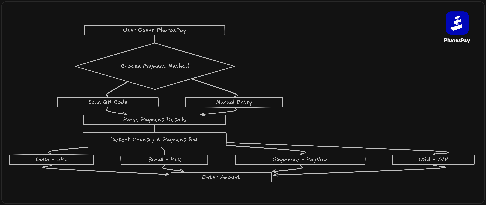
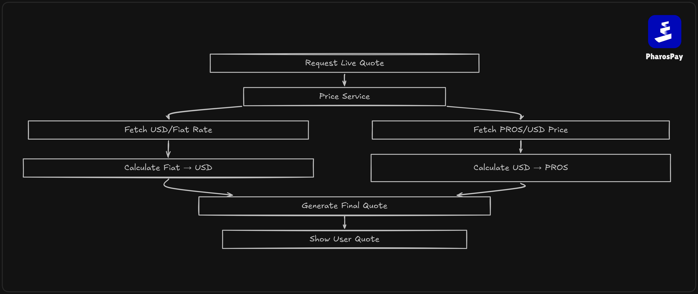
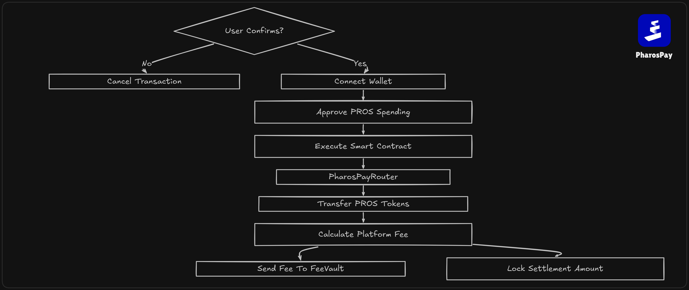
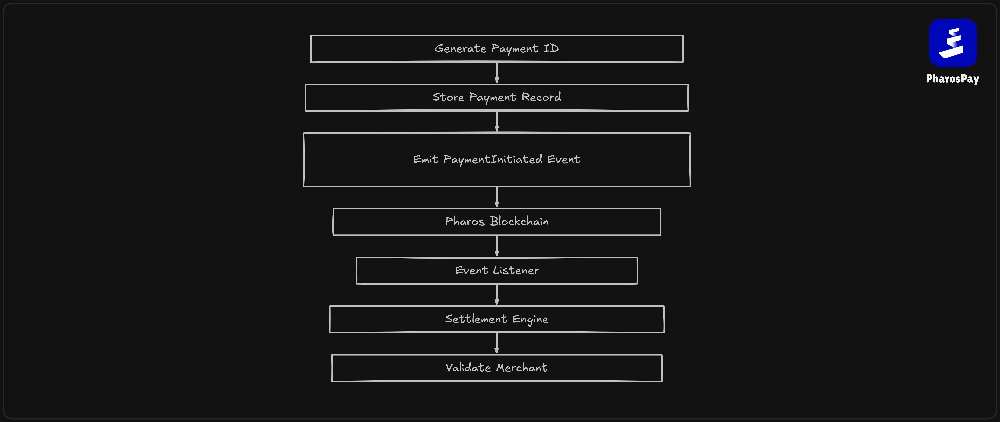

# PharosPay

PharosPay is a global crypto-to-fiat payment system on the Pharos blockchain. It allows users to pay local merchants using PROS tokens while merchants receive local fiat currency directly in their standard bank accounts or retail accounts. The system parses standard local QR formats, resolves real-time exchange rates, processes payments on-chain, and orchestrates settlement execution through country-specific payout rails.

## Problem

Cross-border and retail payments remain fragmented globally. Different jurisdictions rely on localized, domestic instant payment networks:
* India uses UPI (Unified Payments Interface)
* Brazil uses PIX
* Singapore uses PayNow
* The United States uses ACH (Automated Clearing House)
* And many other countries

Traditional cross-border settlement solutions are slow, expensive, and involve multiple intermediary correspondent banks. While public blockchains solve the transfer-of-value layer, they do not bridge the gap to real-world fiat settlement at retail points-of-sale. Merchants cannot easily accept raw cryptocurrency due to regulatory, volatility, and technical barriers. PharosPay bridges this gap by enabling consumers to pay in tokens and merchants to receive local bank settlement.

## What We Built

PharosPay integrates the user checkout flow, the smart contract execution registry, and the backend fiat settlement engine:
1. The user scans a local payment QR code or inputs merchant destination credentials.
2. The Price Service calculates a live exchange quote converting local fiat to USD and then to PROS tokens, adding platform fees.
3. The user approves and executes the payment transaction using a Web3 wallet (MetaMask) on the Pharos blockchain.
4. The smart contract locks the PROS tokens, deducts the platform fee to the Fee Vault, and emits a payment execution event.
5. The backend listener captures the event, triggers the Settlement Engine, and pushes a settlement job to the execution queue.
6. The Settlement Engine validates the merchant and executes the payout in local fiat via a provider adapter.
7. The transaction status is tracked end-to-end and recorded inside the local PostgreSQL database.
8. The system generates structured JSON and PDF receipts containing transaction details, on-chain TX hashes, and banking reference numbers (UTR).

## Architecture

* **Frontend**: React single-page application built with Vite and TypeScript, featuring Web3 wallet hooks (ethers.js), QR scanning libraries (html5-qrcode), and a dark/light UI.
* **Backend**: Node.js/Express API server running asynchronous BullMQ queue processors and event listeners powered by Redis.
* **Smart Contracts**: Solidity smart contracts (v0.8.24) deployed using Foundry, managing token allowances, payment locks, fee vaults, and pricing oracle mappings.
* **Settlement Layer**: Task scheduling and validation pipeline managing transaction retries, provider callbacks, and webhook listeners.
* **Provider Layer**: Modular payment provider adapters (e.g. Simulation, RazorpayX, Cashfree) implementing localized payout routing by country.
* **Price Service**: Memory-cached pricing engine pulling from the Pharos Oracle, CoinGecko API, and DexScreener to maintain live exchange rates.
* **Database**: PostgreSQL relational database containing merchant profiles, payment audits, settlement traces, and logging trails.

## Features

* Multi-country payment support
* QR payment support
* Wallet integration
* Smart contract settlement records
* Payment history
* Live FX conversion
* Live PROS pricing
* Transaction receipts
* UTR/reference tracking
* Responsive UI
* Dark/light mode

## Testnet Verification

The contracts are compiled and deployed to the Pharos Atlantic Testnet.
* **Chain ID**: 688689
* **Explorer URL**: https://atlantic.pharosscan.xyz

### Deployed Contract Addresses

* **MockPROS**: `0x3E29AF7126051dC75B003fA10c4a9A315f2200C4`
* **PriceOracle**: `0xe2eD0C7c82195BC462A976dB198d973d395D9805`
* **FeeVault**: `0x22F9D0109f43BB00b784147852fc0EA06bF5af82`
* **PharosPayRouter**: `0x7c1B6eeCCb881dA5EBA50Ec1e7202B0De76E11A0`

Multiple transactions were executed and verified on the Pharos Atlantic Testnet. Payment locking and fee splitting events were captured on-chain. Settlement records were successfully generated and validated, and quote generation and fee collection parameters were tested.

## Project Structure

```
PharosPay/
├── src/                          # Smart contracts (Solidity 0.8.24)
│   ├── MockPROS.sol              # Testnet PROS token
│   ├── PriceOracle.sol           # Multi-pair price oracle
│   ├── FeeVault.sol              # Fee treasury vault
│   └── PharosPayRouter.sol       # Core payment router
├── script/                       # Foundry deployment scripts
│   ├── DeployFeeVault.s.sol
│   ├── DeployPharosPay.s.sol
│   ├── DeployPharosPayRouter.s.sol
│   ├── DeployPriceOracle.s.sol
│   └── SetPrices.s.sol
├── test/                         # Solidity unit tests (21 test suite cases)
│   ├── PharosPayRouter.t.sol
│   └── PriceOracle.t.sol
├── backend/                      # Express.js API server
│   ├── config/                   # Providers config factory
│   ├── database/                 # Schema migrations and models
│   ├── lib/                      # Helper libraries and parser logic
│   ├── providers/                # Payout provider adapters by country
│   ├── routes/                   # Router endpoints (quotes, settles, history)
│   ├── services/                 # PriceService, EventListener, SettlementEngine
│   ├── validators/               # Rails validators (UPI, PIX, ACH)
│   └── server.js                 # API server entrypoint
├── frontend/                     # Vite + React frontend client
│   ├── src/
│   │   ├── components/           # UI elements (QRScanner, PaymentForm, TxStatus)
│   │   ├── pages/                # Pages (Home, Pay, History, Wallet, Merchant)
│   │   ├── hooks/                # Contracts and wallet hooks
│   │   ├── context/              # PaymentContext state wrapper
│   │   ├── App.jsx               # Client shell and routing
│   │   └── main.tsx              # UI bootstrapping
│   └── index.html                # App launcher
└── RELEASE.md                    # Release logs
```

## Running Locally

### Prerequisites

* Node.js v18+
* PostgreSQL v14+
* Redis v6+
* Foundry toolchain (forge)

### 1. Smart Contracts Setup

Install Solidity dependencies:
```bash
forge install
```

Compile contracts:
```bash
forge build
```

Run test suite:
```bash
forge test -vv
```

### 2. Backend Setup

Change to backend directory:
```bash
cd backend
```

Install packages:
```bash
npm install
```

Copy and edit environment variables:
```bash
cp .env.example .env
```

Start backend development server:
```bash
npm run dev
```

### 3. Frontend Setup

Change to frontend directory:
```bash
cd frontend
```

Install packages:
```bash
npm install
```

Copy and edit environment variables:
```bash
cp .env.example .env
```

Start frontend development server:
```bash
npm run dev
```

## Smart Contract Deployment

Configure your private key and deploy contracts using Foundry:

```bash
export PRIVATE_KEY=your_private_key_here
forge script script/DeployPharosPay.s.sol:DeployPharosPay \
  --rpc-url https://atlantic.dplabs-internal.com \
  --private-key $PRIVATE_KEY \
  --broadcast
```

Set the feed prices in the oracle:
```bash
forge script script/SetPrices.s.sol:SetPrices \
  --rpc-url https://atlantic.dplabs-internal.com \
  --private-key $PRIVATE_KEY \
  --broadcast
```

## Demo Video

[Watch Demo Video](https://github.com/user-attachments/assets/069a2fcc-e38f-4dca-90e3-052a35d0b7f9)

# Workflow

## Step 1 - Payment Initiation

User scans a QR code or manually enters payment details. PharosPay identifies the destination country and local payment rail.



---

## Step 2 - Live Quote Generation

The pricing engine fetches live fiat exchange rates and the current PROS market price to generate a settlement quote.



---

## Step 3 - Onchain Payment Execution

The user approves the transaction. PROS tokens are transferred, platform fees are collected, and settlement funds are locked onchain.



---

## Step 4 - Settlement Processing

Blockchain events trigger the settlement engine, which validates the merchant and routes the payout through the appropriate country adapter.



---

## Step 5 - Receipt & Completion

After settlement, the system generates receipts, explorer links, transaction hashes, reference numbers, and settlement records.


## Example Payment Flow

1. **Scan**: A customer scans a merchant's UPI QR code `upi://pay?pa=merchant@upi&pn=Store` on the frontend client.
2. **Quote**: The frontend queries the backend `/api/quote?amount=100&currency=INR`. The Price Service queries the on-chain Price Oracle for PROS/USD ($0.6360) and USD/INR (83.58).
3. **Approve**: The client calculates that 1.9176 PROS are required (1.88 PROS payment + 0.0376 PROS fee). The user signs a token allowance approval transaction on MetaMask.
4. **Lock**: The user signs the `pay` transaction. The router transfers 1.9176 PROS from the user: 1.88 PROS are locked in the contract, and 0.0376 PROS are routed to the FeeVault.
5. **Event**: The router emits a `PaymentInitiated` event on the blockchain.
6. **Settle**: The backend `EventListener` picks up the event and adds a job to the BullMQ queue. The `SettlementEngine` calls the simulator payout adapter.
7. **Complete**: The adapter verifies payment delivery and updates the transaction status in the database to `SETTLED`.

## Future Work

* Mainnet deployment on Pharos chain
* Production banking provider integrations (RazorpayX, Cashfree)
* Direct PIX/PayNow/ACH local bank APIs
* Automated KYC and identity verification modules
* Real-time compliance monitoring and fraud scoring
* Merchant dashboard portals and API key generation
* Settlement analytics dashboard
* Multi-chain payment routing

## License

MIT
